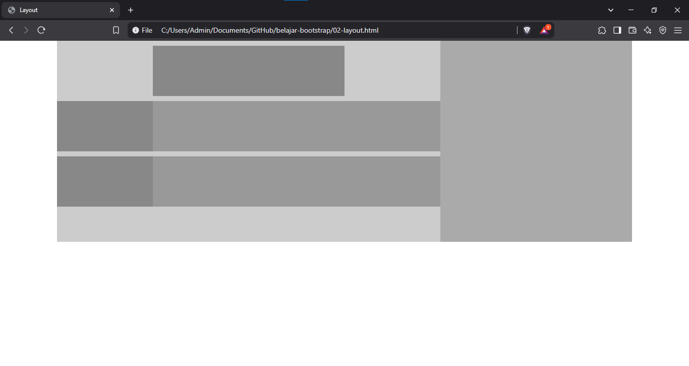

# Layout

## Dasar-dasar Layout

- Bootstrap menyediakan berbagai class khusus untuk pengaturan layout website agar dapat tampil rapi dan responsif pada berbagai perangkat.
- Fitur layout dapat digunakan secara terpisah dengan memanggil file CSS **layout.css** atau **layout.min.css**.
- Layout Bootstrap menggunakan grid system yang terdiri dari baris dan kolom yang dibungkus dengan container.
- **Container** merupakan tag `<div>` yang diberi class `container` untuk lebar tidak memenuhi layar, atau class `container-fluid` agar lebar memenuhi layar.
- **Baris** merupakan tag `<div>` yang diberi class `row`.
- **Kolom** merupakan tag `<div>` yagn diberi class `col` atau `col-*`.
- Nama class pada kolom disesuaikan dengan spesifikasi breakpoint dan lebar kolom dengan format sebagai berikut

    ```html
    <div class="col-{breakpoint}-{lebar kolom}"></div>
    ```

- Breakpoint diisi sesuai dengan target breakpoint, di antaranya:
  
    - **sm** (>=576px)
    - **md** (>=768px)
    - **lg** (>=992px)
    - **xl** (>=1200px)
    - **xxl** (>-1400px)

- Jika target layar kurang dari breakpoint 576px, breakpoint tidak perlu diisi, jadi langsung diikuti lebar kolom.
- Lebar kolom merupakan angkan dari 1 sampai 12, di mana 12 untuk lebar memenuhi container.
- Struktur penulisan container, baris dan kolom adalah sebagai berikut.

    ```html
    <div class="container">
        <div class="row">
            <div class="col-md-3"></div>
            <div class="col-md-7"></div>
        </div>
        <div class="row">
            <div class="col-md-3"></div>
            <div class="col-md-7"></div>
        </div>
    </div>
    ```

## Ketentuan Layout

Beberapa ketentuan mengenai layout pada Bootstrap yaitu:

- Menggunakan class `col` tanpa diikuti spesifikasi breakpoint dan lebar kolom akan membuat kolom memiliki lebar sama dan memenuhi lebar container.
- Jika ada 3 atau lebih kolom dan salah satu kolom ditentukan lebarnya, maka kolom lain akan menyesuaikan sisanya dengan masing-masing kolom lebarnya sama.
- Jika satu kolom diberi class `col-{breakpoint}-auto`, maka lebar kolom mengikuti lebar konten (isi dari kolom tersbut) dan kolom lain menyesuaikan.
- Untuk membagi kolom menjadi 2 baris atau lebih dan masing-masing kolom lebarnya sama, untuk memisahkan masing-masing baris dapat menggunakan tag `<div>` dengan class `w-100`.
- Semua kolom berapapun lebarnya akan disusun bertumpuk pada layar yang kurang dari nilai breakpoint yang ditentukan. Jika ingin tetap disusun horizontal, gunakan class `col` saja atau `col-{lebar kolom}`.
- Untuk mendapatkan susunan dan lebar kolom yang berbeda pada setiap ukuran layar yang berbeda dapat menggunakan kombinasi class untuk kolom. Misalnya `col-md-4` dan `col-sm-8` jika digunakan bersamaan akan menghasilkan lebar kolom 4 pada layar sedang dan lebar kolom 8 pada layar kecil.
- Gunakan class `align-items-start`, `align-items-center`, atau `align-items-end` bersama class `row` untuk mengatur perataan masing-masing kolom secara vertikal.
- Gunakan class `align-self-start`, `align-self-center`, atau `align-self-end` bersama class `col` untuk mengatur perataan masing-masing kolom secara vertikal.
- Gunakan class `justify-content-start`, `justify-content-center`, `justify-content-end`, `justify-content-around` atau `justify-content-between` bersama class `row` untuk mengatur perataan kolom secara horizontal.
- Gunakan class `no-gutters` untuk menghilangkan jarak antar kolom.
- Gunakan class `order-first`, `order-last`, atau `order-{posisi}` untuk mengatur urutan kolom, di mana posisi dapat diisi dengan angka 1 sampai 12.
- Gunakan class `offset-{breakpoint}-{offset}` untuk mengatur offset kolom. Offset dapat diisi angka 1 sampai 12.
- Gunakan class `mr-auto` atau `ml-auto` untuk mengatur margin kanan atau margin kiri auto pada kolom.
- Sebuah kolom dapat berisi baris lagi di dalamnya, sehingga dapat membagi kolom menjadi beberapa baris dan kolomyang lebih kecil.

## Contoh Penerapan Layout

Berikut contoh penggunaan grid untuk membuat layout

```html
<!DOCTYPE html>
<html lang="en">
  <head>
    <meta charset="UTF-8" />
    <meta
      name="viewport"
      content="width=device-width, initial-scale=1.0, shrink-to-fit=no"
    />
    <link rel="stylesheet" href="bootstrap/css/bootstrap.min.css" />
    <style>
      .main {background: #ccc;}
      .side {background: #aaa;height: 400px;}
      .image {background: #888;}
      .article {background: #999; }
      .image,.article {height: 100px; margin-top: 10px;}
    </style>
    <title>Layout</title>
  </head>
  <body>
    <div class="container">
      <div class="row">
        <div class="col-sm-8 main">
          <div class="row justify-content-center">
            <div class="col-6 image"></div>
          </div>
          <div class="row">
            <div class="col-3 image"></div>
            <div class="col article"></div>
          </div>
          <div class="row">
            <div class="col-3 image"></div>
            <div class="col article"></div>
          </div>
        </div>
        <div class="col side"></div>
      </div>
    </div>

    <script src="bootstrap/js/bootstrap.bundle.min.js"></script>
  </body>
</html>

```

Kode di atas akan menghasilkan tampian seperti berikut.
